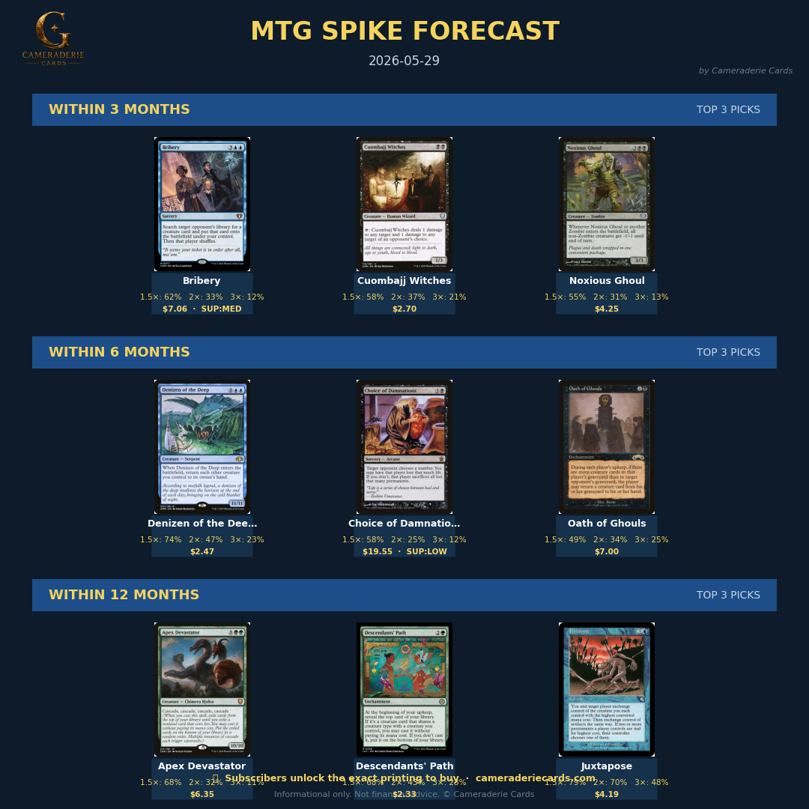

# mtg-buy-signal · MTG card-price BUY signal

> **A buy-signal engine for the Magic: The Gathering secondary market.**
> Dated, falsifiable forecasts of which cards will reach a target gain within a chosen window.
> *Validated on a sealed 15-year held-out block. Top-20 buy basket returns +212% net of fees and dealer haircut.*
>
> Part of the **Cameraderie Cards** toolkit: [`mtg-buy-signal`](https://github.com/rnorlund/mtg-buy-signal) (you are here) · [`mtg-sell-signal`](https://github.com/rnorlund/mtg-sell-signal) · [`mtg-reprint-signal`](https://github.com/rnorlund/mtg-reprint-signal)

A two-stage hierarchical model trained on **15.7 years of daily prices, 6,944 liquid cards, 235 features**:

- **Stage 1 — Card-level:** for every liquid card, predict P(reach ≥ g × the buy price within H months). g and H are dials (1.5× / 2× / 3× / 5× ; 3 / 6 / 12 / 18 / 24 / 36 months).
- **Stage 2 — Printing-level:** within each picked card, rank the available printings (Beta vs Unlimited vs modern reprint) so the buyer knows *which exact version* to acquire. The cheap modern reprint of a vintage card almost never spikes the same way as the Alpha/Beta original.
- **Production scoring** blends Stage-1 probability with 30-day price momentum at a per-target weight tuned on validation.

The cleanest demo is **Berserk**: when the card is hot, Stage 2 ranks Beta ($300, P(≥1.5×) = 90%) over the modern Conspiracy reprint ($17, P = 22%). The model finds the right *version*, not just the right name.

## Headline held-out results (sealed 2023→2026 test block)

| Target | Base rate | **Top-20 precision (ours+momentum)** | Momentum only |
|---|---|---|---|
| ≥ 1.5× / 24 mo | 26.5% | **100%** | 60% |
| ≥ 2× / 24 mo | 14.5% | **90%** | 50% |
| ≥ 3× / 24 mo | 6.2% | **50%** | 40% |

Net-of-fees realised return (top-20 picks, monthly snapshots over 2023→2026):

| Exit assumption | Model top-20 | Random baseline |
|---|---|---|
| Gross sustained-peak | **+488%** | +47% |
| Net retail sale (12.5% fee + $1.50 ship) | **+403%** | +39% |
| **Net buylist sale (55% of retail)** | **+212%** | **−47%** |

Random picks *lose money* once you account for fees and the buylist haircut. The model's net buylist return is +212%. Full methodology, walk-forward validation across 5 rolling test years, calibration curves, feature importance, and the substitution-event validation against the September 2024 Commander bans are in [docs/REPORT.pdf](docs/REPORT.pdf).

## Forecast archive

Dated, falsifiable PDFs land in [`forecasts/`](forecasts/). Each one was published on its dated day; nothing is backdated. Verify the picks against future prices yourself — that's the point.

<!-- FORECAST_TABLE_START -->
| Date | Forecast |
|---|---|
| 2026-07-10 | [PDF](forecasts/2026-07-10/spike_forecast_2026-07-10.pdf) |
| 2026-07-08 | [PDF](forecasts/2026-07-08/spike_forecast_2026-07-08.pdf) |
| 2026-07-07 | [PDF](forecasts/2026-07-07/spike_forecast_2026-07-07.pdf) |
| 2026-07-06 | [PDF](forecasts/2026-07-06/spike_forecast_2026-07-06.pdf) |
| 2026-07-05 | [PDF](forecasts/2026-07-05/spike_forecast_2026-07-05.pdf) |
| 2026-07-04 | [PDF](forecasts/2026-07-04/spike_forecast_2026-07-04.pdf) |
| 2026-07-03 | [PDF](forecasts/2026-07-03/spike_forecast_2026-07-03.pdf) |
| 2026-07-02 | [PDF](forecasts/2026-07-02/spike_forecast_2026-07-02.pdf) |
| 2026-07-01 | [PDF](forecasts/2026-07-01/spike_forecast_2026-07-01.pdf) |
| 2026-06-30 | [PDF](forecasts/2026-06-30/spike_forecast_2026-06-30.pdf) |
| 2026-06-29 | [PDF](forecasts/2026-06-29/spike_forecast_2026-06-29.pdf) |
| 2026-06-28 | [PDF](forecasts/2026-06-28/spike_forecast_2026-06-28.pdf) |
| 2026-06-27 | [PDF](forecasts/2026-06-27/spike_forecast_2026-06-27.pdf) |
| 2026-06-26 | [PDF](forecasts/2026-06-26/spike_forecast_2026-06-26.pdf) |
| 2026-06-25 | [PDF](forecasts/2026-06-25/spike_forecast_2026-06-25.pdf) |
| 2026-06-24 | [PDF](forecasts/2026-06-24/spike_forecast_2026-06-24.pdf) |
| 2026-06-23 | [PDF](forecasts/2026-06-23/spike_forecast_2026-06-23.pdf) |
| 2026-06-22 | [PDF](forecasts/2026-06-22/spike_forecast_2026-06-22.pdf) |
| 2026-06-21 | [PDF](forecasts/2026-06-21/spike_forecast_2026-06-21.pdf) |
| 2026-06-20 | [PDF](forecasts/2026-06-20/spike_forecast_2026-06-20.pdf) |
| 2026-06-19 | [PDF](forecasts/2026-06-19/spike_forecast_2026-06-19.pdf) |
| 2026-06-18 | [PDF](forecasts/2026-06-18/spike_forecast_2026-06-18.pdf) |
| 2026-06-17 | [PDF](forecasts/2026-06-17/spike_forecast_2026-06-17.pdf) |
| 2026-06-16 | [PDF](forecasts/2026-06-16/spike_forecast_2026-06-16.pdf) |
| 2026-06-15 | [PDF](forecasts/2026-06-15/spike_forecast_2026-06-15.pdf) |
| 2026-06-14 | [PDF](forecasts/2026-06-14/spike_forecast_2026-06-14.pdf) |
| 2026-06-13 | [PDF](forecasts/2026-06-13/spike_forecast_2026-06-13.pdf) |
| 2026-06-12 | [PDF](forecasts/2026-06-12/spike_forecast_2026-06-12.pdf) |
| 2026-06-11 | [PDF](forecasts/2026-06-11/spike_forecast_2026-06-11.pdf) |
| 2026-06-10 | [PDF](forecasts/2026-06-10/spike_forecast_2026-06-10.pdf) |
<!-- FORECAST_TABLE_END -->

Each PDF: cover with live-headline track-record, three windows × top-20 picks with card images & calibrated probabilities, plus:
- **CAPACITY** tag (HIGH / MED / LOW market depth — how large a position the market can absorb without you front-running yourself)
- **SUPPLY** tag (LOW / MED / HIGH — dealer-buylist as % of retail; LOW means dealers pay close to retail = scarce/hot, HIGH means dealers far below retail = abundant supply; sourced from Card Kingdom)
- **★N persistence stars** (consecutive forecasts the card has survived in)

> 🔓 **Subscriber-only:** which exact printing of each pick to buy (Beta vs Unlimited vs modern reprint). The cheap reprint of a vintage card almost never spikes the same way as the original — getting the version wrong is the #1 way readers lose money on spike picks. The public PDFs surface the cards; subscribers get the version. See [cameraderiecards.com](https://github.com/rnorlund) for access.

## What's in this repo

| | |
|---|---|
| [`docs/REPORT.pdf`](docs/REPORT.pdf) | 14-section scientific report: held-out methodology, walk-forward, calibration, Berserk case study, negative results |
| [`docs/METHODOLOGY.md`](docs/METHODOLOGY.md) | High-level explanation of the approach |
| [`forecasts/`](forecasts/) | Dated forecast PDFs and social images. Public track record. |
| [`src/mtgspike/`](src/mtgspike/) | Open methodology code: feature engineering, time-blocked split / gating, walk-forward harness, baseline benchmark. **Not** included: the trained model artifacts or the live price pipeline (proprietary). |
| [`examples/`](examples/) | Sample anonymised forecast CSV showing the output schema |

## What's NOT in this repo (and why)

- **Trained model artifacts** (`xgb_g*.json`, calibrators). The IP is the trained weights and the feature-engineering choices learned from years of MTG-finance data. Commercial licence available.
- **The live price-ingest pipeline.** Built on a paid data source under terms that don't permit redistribution.
- **The daily-refresh + auto-publish infrastructure.** Operationally meaningful but not what the science is about.

If you want the live forecast or the trained model for commercial use, get in touch — see *Commercial use* below.

## Cameraderie Cards

`mtg-buy-signal` (powered by the `mtgspike` model) is built by [Cameraderie Cards](https://github.com/rnorlund). The forecasts are part of the broader Cameraderie Cards toolkit for MTG players and investors. Reach out via GitHub issues or the contact on the parent site.

## Commercial use

This repository is released under [**PolyForm Noncommercial 1.0.0**](LICENSE). Non-commercial use, academic research, and verifying the methodology are explicitly permitted. **Commercial use requires a separate licence** — open an issue or contact Cameraderie Cards directly to negotiate one.

## Sibling repositories

| Repo | Question it answers |
|---|---|
| [`mtg-buy-signal`](https://github.com/rnorlund/mtg-buy-signal) | Which cards are likely to spike upward — when to **buy** |
| [`mtg-sell-signal`](https://github.com/rnorlund/mtg-sell-signal) | Which cards have peaked and are likely to fall — when to **sell** |
| [`mtg-reprint-signal`](https://github.com/rnorlund/mtg-reprint-signal) | Which cards are at risk of being reprinted — when to **brace** |
| [`cameraderie-cards`](https://github.com/rnorlund/cameraderie-cards) | Umbrella landing page

## Important disclaimers

- **Not financial advice.** Forecasts are informational. Past performance does not guarantee future returns. MTG cards are a volatile, illiquid collectibles market; you may lose money.
- **Capacity matters.** If a thousand readers all buy the same top pick, you front-run yourselves. Cap your position size to the card's market depth (the PDF tags each pick HIGH / MED / LOW).
- **Regime risk.** Held-out 2023 fold showed the model degrades when training data doesn't cover a regime shift; production training is rolled forward continuously to address this. See [docs/REPORT.pdf §13](docs/REPORT.pdf) for full transparency.
- **TCG / eBay terms.** Acting on forecasts means buying and selling on collector marketplaces with their own terms and fees. Plan accordingly.
