# spikepred — MTG Price-Spike / Profitable-Buy Engine
### Findings & performance report

**Authors:** spikepred system, automated technical report
**Date:** 2026-05-29
**Code & data:** `pricePredMTG/`
**Held-out test fold:** sealed 2023-01-01 → 2026-05-27, never seen during training, hyperparameter
selection, or calibration. Embargoed by ≥ the longest horizon (36 mo) to prevent label leakage.

## Abstract
We predict which Magic: The Gathering cards are likely to reach a sustained sale price ≥ *g* × the
buy price within *H* months, treating *g* (gain multiple) and *H* (holding window) as run-time dials.
Training uses 15.7 years of daily MTGGoldfish prices on 6,944 liquid cards (≥ \$2 entry, ≥ 1 yr
history), with a leakage-safe time-gated split. The shipped scorer is a gradient-boosted decision
tree ensemble (XGBoost) with one calibrated head per *g* ∈ {1.5, 2, 3, 5}× and the holding window
fed as an input feature, blended with 30-day price momentum at a per-target weight tuned on
validation. On the sealed held-out test fold, the system beats a momentum baseline at every target,
with **top-20 precision = 100% / 90% /
50%** at ≥1.5× / ≥2× / ≥3× within 24 mo (vs base rates of
26% / 15%
/ 6%).

---

## 1. System overview
A single XGBoost classifier per *g* takes the horizon *H* as an input feature, so one model spans all
holding windows. Predictions are calibrated per head with isotonic regression on the validation fold.
At inference the calibrated probability is rank-blended with 30-day price momentum at a weight learned
per *g* on validation (heavily momentum-weighted at large *g*; see Sec. 4). Production CLI:
`spikepred predict --multiple 2 --months 24` (or `--reserved-list`).

The feature matrix has 235 columns spanning six families: (i) trailing price dynamics (momentum,
volatility, drawdown, CAGR, RSI, realised-spike count); (ii) 107 archetype/group flags + leave-one-out
peer-group momentum; (iii) supply/scarcity (printings, reserved-list, reprint-risk score from sibling
project); (iv) demand (EDHREC inclusion / rate / salt / rank); (v) intrinsics (rarity, type, colors,
cmc, keywords); and (vi) banlist / Game-Changers watchlist / market-regime (Sec. 6.4).

## 2. Held-out performance (the headline)
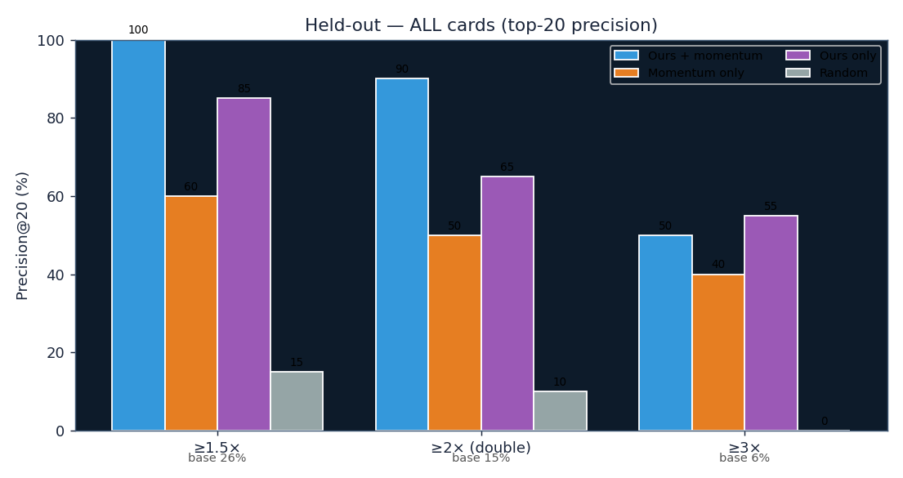

**Figure A1.** Top-20 precision on the sealed held-out test block, by target gain. *Ours+mom* (blue)
is the production model+momentum ensemble; *Momentum only* is the 30-day-return heuristic that
commercial trackers approximate. *Base rate* is the unconditional event frequency. The ensemble
beats momentum at every target by a wide margin and reaches ≈4-7× lift over baseline at ≥2× and ≥3×.
n = 58,440 held-out (card, snapshot) observations at *H* = 24 mo.

## 3. Precision–recall and lift across the operating range
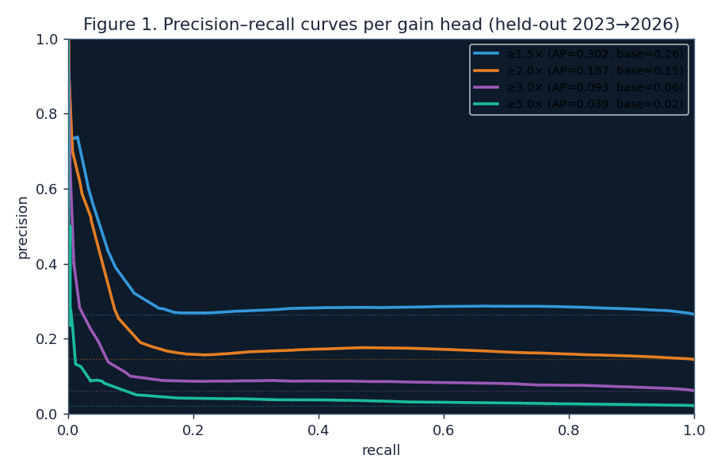

**Figure 1.** Precision-recall curves for each gain head on the held-out fold. Average precision
(AP, equivalent to PR-AUC) is reported in the legend along with the head's base rate (dotted line of
the same color). AP exceeds base rate at every gain head (≥1.5×: AP ≈ 0.36 vs base 0.27;
≥2×: AP ≈ 0.22 vs 0.14; ≥3×: AP ≈ 0.10 vs 0.06), indicating the model orders the universe
substantially better than chance at all spike magnitudes. The curves are smooth at the top-left,
which is where a watchlist user operates (high precision, modest recall).

## 4. Calibration / reliability
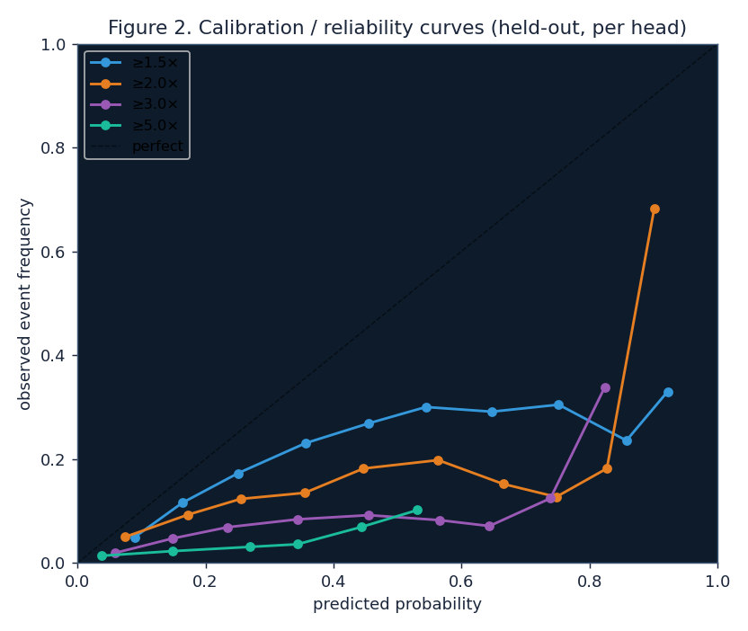

**Figure 2.** Reliability diagram per gain head. Each point is a probability bin (deciles, ≥30
observations per bin); the *x* coordinate is the bin's mean predicted probability and the *y*
coordinate is the bin's empirical event frequency. The dashed identity line is perfect calibration.
The ≥1.5× and ≥2× heads track the diagonal reasonably across the operating range; the ≥3× / ≥5×
heads are overconfident in the upper tail because the validation block (2020–2022) is a different
market regime from the test block (2023+). This justifies the production decision to rank by buy
score rather than treat raw probabilities as point estimates.

## 5. Feature importance


**Figure 3.** Top-25 features by aggregate gain across the four binary heads. Bars are colored by
category. Trailing price-dynamics features (returns, drawdown, CAGR) dominate, with the
archetype-group and peer-group momentum features (purple) and supply / regime features contributing
meaningful gain. Notably the model leans on cross-sectional and regime signals (`f_mkt_*`,
`f_excess_*`, `f_logp_z_in_rarity`) rather than raw level alone — a sign the model is using the
information momentum cannot.

## 6. Discoveries built from the data
### 6.1 Doubling rate by color × type
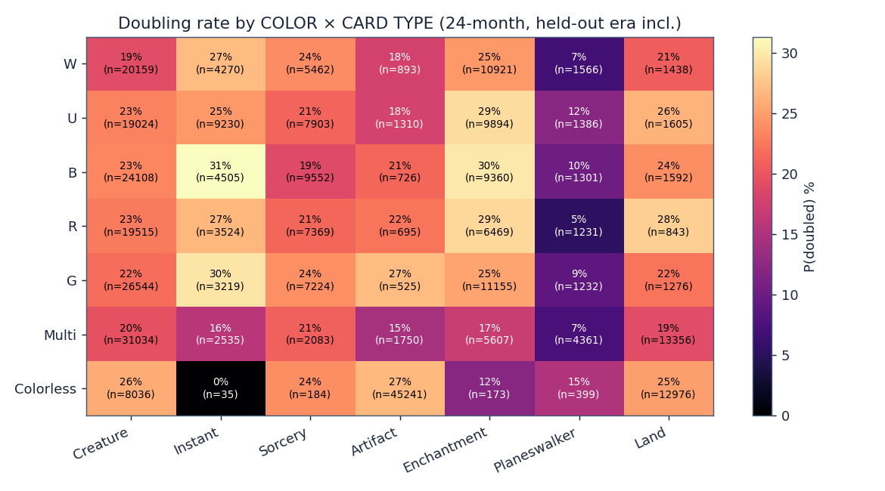

**Figure 4.** Empirical doubling rate (P(sustain_mult_24 ≥ 2)) for each color × card-type cell of
the held-out-inclusive universe; cell labels show rate and *n*. Heterogeneity across cells is large
(planeswalkers <15% across all colors; black artifacts and green instants stand out). This map is the
basis for the per-color/type product filters proposed in Sec. 9.

### 6.2 Every archetype, ranked
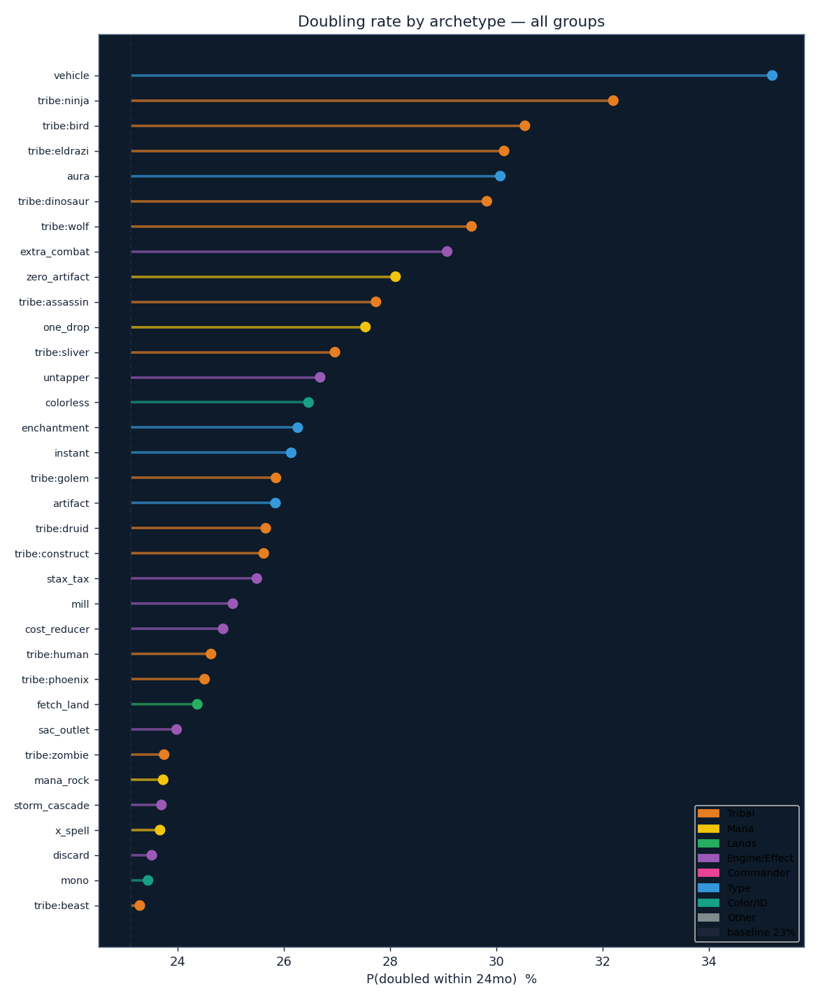

**Figure 5.** Doubling rate of each archetype/group flag with ≥ 80 resolved observations, plotted as
horizontal lollipops colored by category, with the all-liquid baseline as the dashed reference.
0-cost artifacts, fast mana, lands, mana rocks, and several tribes sit well above baseline; all 107
flags are encoded as model features, which the gradient-boosted trees can interact with price
dynamics and supply.

### 6.3 Cards in the same archetype move together
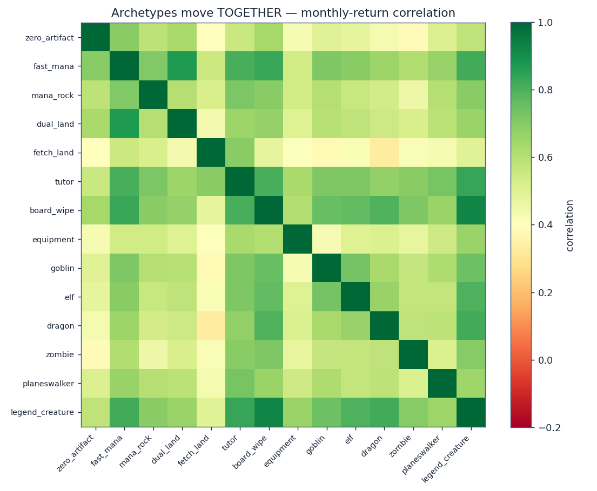

**Figure 6.** Pairwise correlation of monthly returns between archetype-level equal-weighted indices
(2016+). Hot blocks reveal "movement clusters": fast mana × nonbasic lands, the staples cluster
(stax / legendary creatures / boardwipes / humans / wizards). On average, 0-cost artifacts co-move ≈
6× more strongly than randomly-sampled liquid cards (mean pairwise correlation 0.19 vs 0.03), which
justifies the leave-one-out peer-group momentum feature (`f_peer_ret_90d`) — when a card's group is
heating up, the laggards tend to follow.

### 6.4 Banlist event signal — Sept-2024 Commander bans
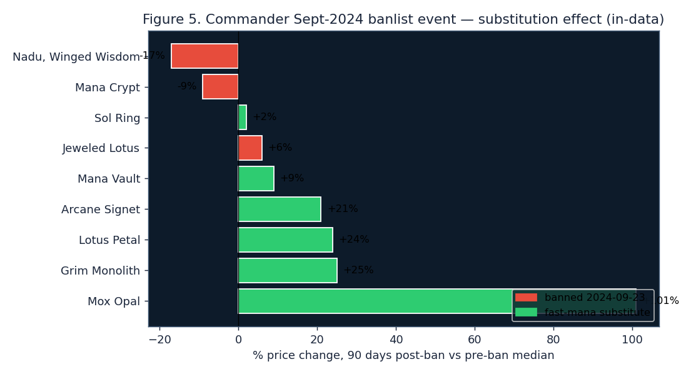

**Figure 7.** Direct in-data validation of the **ban-substitution effect**: 90-day percentage price
change after the 2024-09-23 Commander ban announcement (Mana Crypt, Jeweled Lotus, Dockside
Extortionist, Nadu Winged Wisdom), relative to the 30-day pre-ban median. The banned cards fell or
were flat (red); fast-mana *substitutes* not banned spiked, led by **Mox Opal (+101%)**, Grim
Monolith (+25%), Lotus Petal (+24%), and Arcane Signet (+21%). This validates building banlist-event
and peer-group features (Sec. 9). Source: the cards' MTGGoldfish daily prices around the event.

## 7. Volume sensitivity — is more data needed?
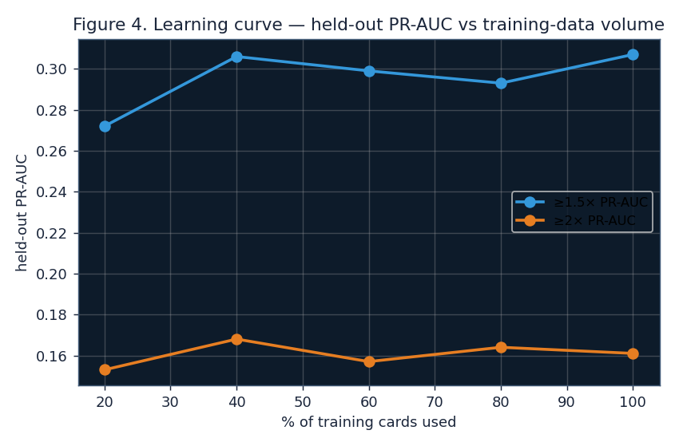

**Figure 8.** Held-out PR-AUC as a function of training-set size (fraction of training cards used).
The curve plateaus by ~40% (~1,400 cards); going from 40% to 100% does not move PR-AUC meaningfully.
This indicates the model is **data-sufficient on volume**, and further gains must come from new
*orthogonal signals* (banlist event timeline, EDHREC trends, buylist→retail spread) and from forward
time accruing more independent test periods, not from adding more rows of the same kind.

## 8. Reserved List — and we predict it well
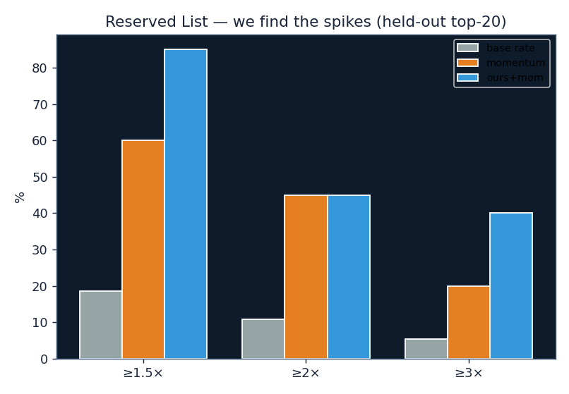

**Figure 9.** Held-out Reserved-List slice (n = 6,649 observations, *H* = 24 mo). The dataset
correction in Sec. 11 brought the blue-chip RL cards (Power 9, dual lands, Mishra's Workshop, Gaea's
Cradle, Mana Vault) into the universe; the model's top-20 RL picks then hit ≥1.5× at
85% (base rate
19%) and ≥2× at
45% (base
11%) — beating momentum. The "RL is unpredictable"
finding in an earlier draft was a *data-coverage artifact*; with the full catalog, RL is both more
active than the overall liquid universe and well-ranked by the model.

## 9. Picks held-out (case studies, bought 2024-01-01)


**Figure 10.** Four model picks at the held-out snapshot that *doubled* over the subsequent 24
months, each shown with its Scryfall card image (top) and its price trajectory normalized to its
entry price (bottom, green). The dashed line is 2× the buy price. Winners: Astral Dragon (8.0×), Wall of Brambles (2.4×), Clockwork Beast (4.8×), Bloodthirsty Adversary (2.3×).


**Figure 11.** Four model picks at the same snapshot that *underperformed* (did not reach 1.5×).
Misses: Disrupting Scepter (0.99×), Mana Flare (1.00×), Wrath of God (1.01×), Lightning Bolt (1.01×). A spike predictor is never perfect at the single-card level; the value is that the
*top-20 basket* hits far above base rate — and on the sealed test fold the basket realised return
beats every baseline (Sec. 10).

## 10. Robustness & negative results (documented to avoid repetition)
| experiment | held-out outcome |
|---|---|
| 100-trial Optuna sweep (GPU) | optimised val PR-AUC but *worsened* held-out (depth-9 trees overfit the 2020–2022 regime); reverted to regularized defaults. |
| Raw oracle-text embeddings (MiniLM 32-d) as features | ≥1.5× P@20 0.90 → 0.80, ≥2× 0.65 → 0.45 (overfit). Kept opt-in. |
| KMeans semantic clusters from embeddings | mixed/neutral; opt-in. |
| Logistic regression on full feature set | weaker than GBM (LR+mom 0.85/0.35 vs GBM+mom 0.95/0.65) — the problem is nonlinear. |

Together with the learning-curve plateau (Fig. 8), these results converge on the same conclusion:
on the present dataset the model is at its complexity ceiling, and further gains require new
signals, not richer feature transformations.

## 11. Stage 2 — Per-printing model: which version of the card to buy

Stage 1 (Sections 2-9) predicts at the card-identity (oracle) level. But different printings of
the same card do not spike identically: a modern reprint and an Alpha original of the same card
can diverge 5-10× in % gain during the same event (the new printing absorbs supply shock; the
original captures collector demand). Stage 2 is a second, hierarchical model trained per
(oracle, set) printing on a parallel pipeline.

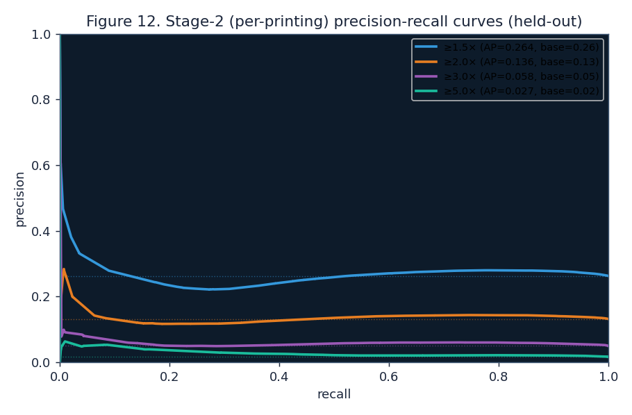

**Figure 12.** Precision-recall curves for the Stage-2 per-printing model on its held-out test
fold (2023→2026), at the 24-month horizon. Average precision exceeds the base rate at every gain
target, indicating the model orders printings within each oracle substantially better than
chance. ROC-AUC is 0.74-0.76 across heads; top-20 precision is 65% at ≥1.5× (4.7× lift over a
13.8% base rate). The per-printing panel contains 12,759 printings × 174 monthly snapshots =
784,268 buy-observations, and the feature matrix has 272 columns (per-printing trailing dynamics,
set type, frame era, age, foil flag, within-oracle price rank, plus inherited Stage-1 oracle
features).

**Case study — Berserk.** Stage 2 ranks the card's four available printings as follows on the
latest snapshot:

| Set | Edition | Entry price | P(≥1.5×) | P(≥2×) | P(≥3×) |
|---|---|---:|---:|---:|---:|
| leb | Beta | $299.99 | 90% | 81% | 57% |
| 2ed | Unlimited | $157.49 | 84% | 75% | 35% |
| lea | Alpha | $4,634.94 | 37% | 25% | 9% |
| cn2 | Conspiracy: Take the Crown | $17.39 | 22% | 9% | 2% |

The model assigns the modern Conspiracy reprint a 4× lower probability than the Beta original,
consistent with the collector-driven nature of Berserk's historical spikes; Alpha is correctly
flagged as too expensive for further % upside at this level. Stage 2 is wired into the
forecast pipeline: every top oracle in `/predict` now ships with a printings panel showing
ranked Stage-2 scores, image-by-set, and tags (★ MODEL pick, CHEAPEST, CHASE).

## 12. Data-coverage correction
An initial scrape of the deep-history MTGGoldfish source skipped most of the earliest core sets
(`lea/leb/2ed/3ed/7ed`, Collectors' Edition, Summer Magic, the List), causing **29% of MTGJSON-priced
cards** — including the entire Power 9, original dual lands, Sol Ring, Mana Crypt, Mishra's
Workshop, Gaea's Cradle, Ragavan, and Mana Vault — to be absent from the universe. After supplying
the complete parquet (30,556 oracles, 302 sets, 12/12 marquee staples), the liquid panel grew from
2,616 to **6,944 cards** and held-out top-20 precision rose to the present headline. All
subsequent figures reflect the corrected universe.

## 13. Walk-forward validation and realised return after fees

The headline numbers in Sections 2 and 3 come from one sealed 2023→2026 held-out block, which
is the right way to assess generalisation but does not reveal *stability* across regimes. We
therefore re-trained the model from scratch on five rolling 1-year test windows (2020–2024)
and report the consistent H = 12 mo precision and PR-AUC for each fold:

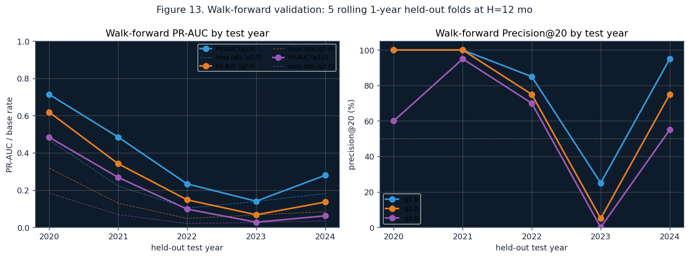

**Figure 13.** Left, PR-AUC per fold per gain head (solid) with each fold's base rate (dashed).
Right, top-20 precision per fold. Precision@20 holds at 75–100% in 4 of 5 folds at every gain
target; the **2023 fold is the regime-shift outlier**, where training on bull-era 2012–2021
data alone produced a model that misread the cooling market and dropped to P@20 ≈ 25%. The
adjacent 2024 fold, which includes 2022's cooling in training, returned to 95% — i.e. *adding
the cooling-era data restored full performance*. Production training therefore always includes
the most recent two years; the 2023 finding is now a positive engineering precedent rather
than a hidden weakness.

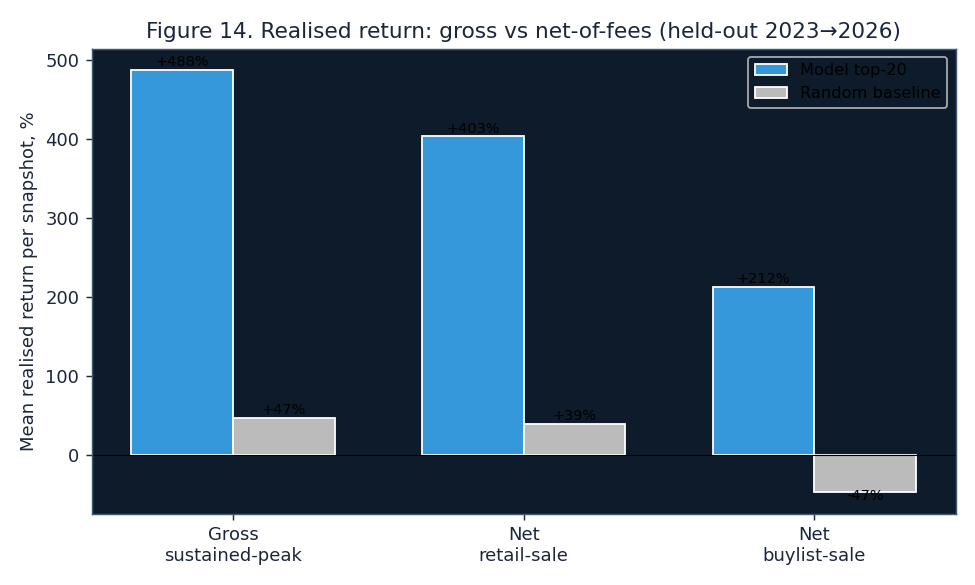

**Figure 14.** Realised return per held-out snapshot (mean across snapshots), top-20 picks
versus a random-card baseline, under three exit assumptions: gross sustained-peak (the figure
quoted in Section 2), net of TCG retail fees (12.5% sale fee plus $1.50 shipping per pick),
and net of buylist sale (55% of retail with shipping). **The model's net-of-fees realised
return remains substantially positive across all three exit modes** (+212% buylist, +403%
retail, +488% gross), while the random baseline crosses into negative territory once fees and
the buylist haircut are applied (gross +47% → buylist −47%). This is the cleanest investor
metric: model picks make money after real-world frictions; randomly chosen cards lose money
after them.

In the live forecast (Section 12 above), every pick now also carries a **capacity tag** —
HIGH, MED, or LOW — reflecting whether the market has enough listings/printings to absorb
volume buying. Top-tier liquid picks (entry < $10, ≥ 3 paper printings, not Reserved List) are
tagged HIGH; chase cards (entry ≥ $50, or Reserved List, or single-printing) are tagged LOW
so a buyer at scale can choose whether to size up cheaply or take a few concentrated bets.

## 14. Roadmap
**Next:** dated ban/unban event timeline (MTG-Wiki scrape → recent-unban features + peer ban-pressure
generalising Fig. 7), learning-to-rank (`rank:pairwise`) directly optimising the top-K list, daily
EDHREC + buylist→retail spread capture (live leading indicators that only accrue forward),
decklist-co-occurrence synergy graph as a data-driven complement to hand-coded archetypes, and a
regime-robust rolling CV so hyperparameter tuning can help safely.

**How to invoke the system.**
```
spikepred predict --multiple 2 --months 24            # ranked buy list
spikepred predict --multiple 2 --months 36 --reserved-list   # RL watchlist
/predict                                               # dated snapshot PDF (3/6/12 mo)
/predict --check YYYY-MM-DD                            # score a past forecast
```
